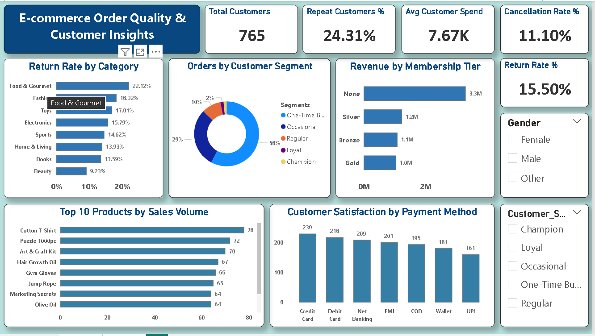

# E-Commerce Sales & Customer Analytics Dashboard

## Overview
This project presents an interactive Power BI dashboard analyzing e-commerce sales data across 1,000+ orders, 8 categories, and 765 customers.

## Tools Used
- Power BI
- DAX
- Power Query
- Excel

## Key Insights
- Identified top-performing product categories
- Analyzed revenue and order trends
- Performed customer segmentation analysis
- Evaluated product performance and quality

## Dashboard Preview

### Sales Overview

### Customer Insights

## Conclusion
This dashboard provides valuable business insights to support data-driven decision-making.

## Business Impact
- Helps Identify high-performing products
- Supports data-driven decision-making
- Improvers customer targeting strategies
