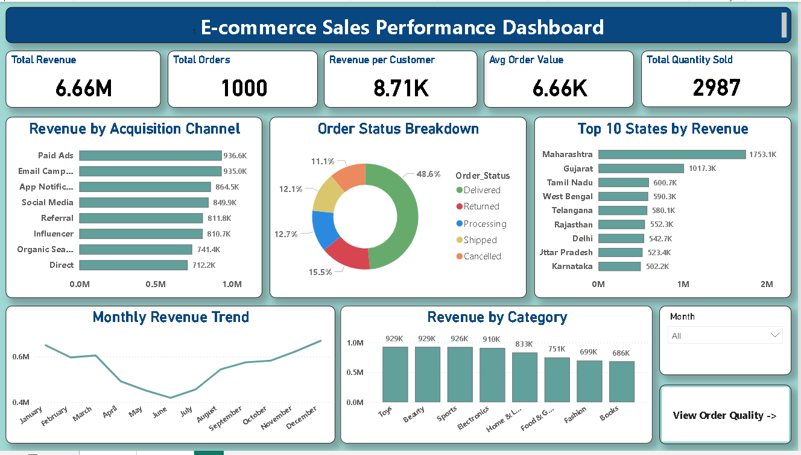

# E-Commerce Sales & Customer Analytics Dashboard

## Project Overview
Developed an interactive two-page Power BI dashboard to analyze e-commerce data, covering 1,000 orders across 8 product categories and 765 customers.

## Dashboard Pages

### Sales Performance
- Analyzed revenue trends over time  
- Evaluated acquisition channels  
- Examined order status distribution  
- Identified top 10 states by revenue
  
  

### Order Quality & Customer Insights
- Assessed return rate patterns  
- Performed customer segmentation  
- Analyzed membership tier performance  
- Identified top-selling products  
- Evaluated customer satisfaction by payment method

## Key Insights
- Maharashtra generates the highest revenue (₹1.8M)  
- 48.6% of orders are successfully delivered  
- Food & Gourmet category has the highest return rate (22%)  
- 58% of customers are one-time buyers, indicating retention opportunities  
- Non-members contribute the highest revenue (₹3.3M)  
- Cotton T-Shirt is the top-selling product (78 units sold)  

## Technical Skills
- DAX: CALCULATE, DIVIDE, DISTINCTCOUNT, COUNTROWS  
- Power Query: Data cleaning and transformation  
- Data Modeling: Established relationships across multiple tables  
- Features: Interactive slicers, cross-filtering, and tooltips  

## Tools Used
Power BI Desktop | DAX | Power Query | Excel  

## Dataset
- 1,000 orders  
- 765 customers  

## Business Impact
- Identifies high-performing regions and products  
- Highlights customer retention opportunities  
- Enables data-driven decision-making for business growth 

## Conclusion
This dashboard provides valuable business insights to support data-driven decision-making.

